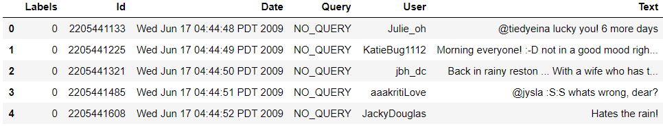
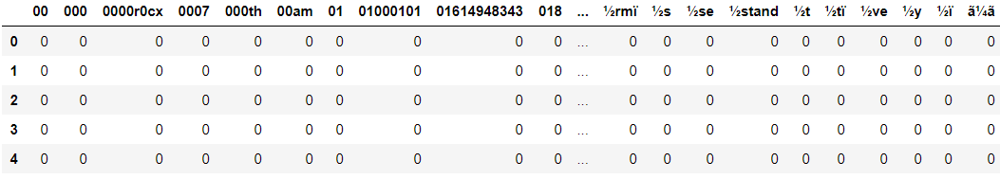
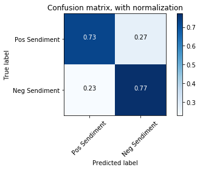
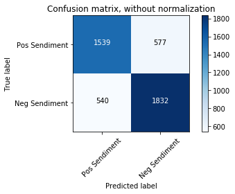
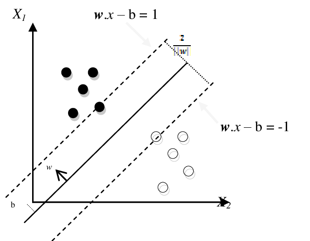
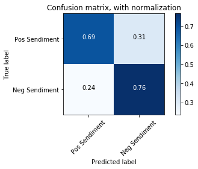
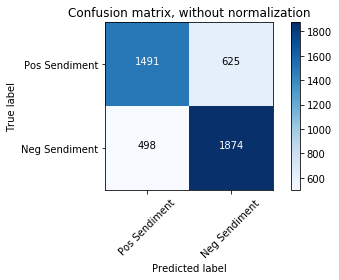

# Machine Learning Engineer Nanodegree
## Capstone Report
Patrick O'Sullivan  
August 2019

## Report

Business Public Sentiment

## Problem Statement

The main objective of the project will be to use Machine Learning to decide the sentiment of text. When give a string of text we want to be able to say whether the sentiment of the text is considered positive or negative. If we can build a model that can accurately say whether a string of text is positive or negative, we can then take live data feeds for various companies (from twitter or other sources) and track the public sentiment over time.

Below I will first go through my baseline model, then my final model and finally evaluate and compare the results.

## Baseline Model

### Naïve Bayes

I used the Naïve Bayes model as my baseline model as it is a quick and easy way to predict classes. It is based on a statistical classification technique known as Bayes Theorem. It is naïve because it assumes that the variables are independent from each other.

It calculates the posterior probability of a certain event A to occur given some probabilities of prior events.

P(A|R)=(P(R|A)P(A))/(P(R))
  
P(A):		Prior probability of a class.  
P(R|A):	Likelihood the probability of predictor given class.  
P(R):		Prior probability pf predictor.  
P(A|R):	Posterior probability of class A given the predictor R.

### Step to perform

To use the Naïve Bayes algorithm to solve classification problems like deciding if text is positive or negative.

* Gather the data (we will use Sentiment140 dataset).
* Convert the dataset into a frequency table.
* Find the probabilities of the events to occur.
* Computes the posterior probability of each class.
* The class with the highest posterior probability is the prediction.

### Strengths & Weaknesses

__Strengths:__
* Easy and quick to implement.
* If the conditional independence holds then it will converge quickly.
* Need less training data.
* Scalable.
* Not sensitive to irrelevant features.

__Weaknesses:__
* The naïve assumption of independent features is unlikely in the real world.

### Implementation

In this project we will develop a Naïve Bayes model that classifies text (twits) sediment as positive or negative. It will be based on the training data from the sendiment140 project (see ref. for details).

This is a supervised binary classification problem as the texts (twits) are either positive or negative. We will provide a labeled dataset to train the model.

**Note:** The Sendiment140 dataset has 1.6M row of data which was taking too long to load so I reduced the dataset to ~0.5M rows.
Also, when creating the frequency matrix, I was getting out of memory errors, so I only use a subset of the loaded data-frame (~18K).

### Preview of the data

Labels:	The sediment 0 for positive and 4 for negative.  
Id:		The id of the twitter.  
Date:		The date of the twit.  
User:		The name of the twitter.  
Text:		The text of the twit.

The data is fairly balance between the target classes.  
4 (positive):	9477  
0 (negative):	8475

### Bag of words

The bag of words process is used when you have a collection of text (twit) data that needs to be processed. You take each word and count its frequency within a piece of text. Each word is treated independently, and the order is irrelevant.

I use the sklearn CountVectorizer class to convert the list of texts (twits) into a matrix with each text (twit) been a row and each word been a column. The corresponding row:column value is the frequency of the occurrence of each word in that twit.

With the large amount of training data and the various characters people use in texts (twits) we have a lot of strange word in the column. It also means we have a lot of column 27387 (when we use the stop_words parameter).

### Count Vectorizer

I use the sklearn.feature_extraction.text.CountVectorizer to
* Separate the string into individual words and give each word (column) an integer ID.
* Count the occurs of each word (column) in each twit (row).
* Covert all words to lower case.
* Ignore all punctuation.
* Ignore all stop words.

### Split Dataset

I split the dataset into four buckets  
X_train:	Training data for the text (twit) column.  
y_train:	Training data for the label column.  
X_test:	Testing data for the text (twit) column.  
y_text:	Testing data for the label column.

Number of rows in the total set: 17952  
Number of rows in the training set: 13464  
Number of rows in the test set: 4488

After splitting the dataset, we need to convert the data into the matrix format just like we did in the sample above using CountVectorizer. For the training data we need to fit first, so the model can learn a vocabulary and then transform to the matrix view. For the testing dataset we only need to transform to the matrix view.

### Model

For this project I used the multinomial Naïve Bayes implementation for my baseline model because it is suitable for classifications with discrete features like word counts for text classification.

    def fitNaiveBayes(self):
        self.naive_bayes = MultinomialNB()
        self.naive_bayes.fit(self.training_data, self.y_train)

Now that I’ve trained the model with the training dataset I can use the testing dataset to make predictions.

    def predict(self):
        self.predictions = self.naive_bayes.predict(self.testing_data)

See the models/BaselineModel class for more detail.

### Evaluation

Now that I have predictions I can evaluate the model to check the accuracy of my baseline model. There are several ways to evaluate a model.

__Accuracy:__ is the fraction of predictions our model got right (e.g. what proportion of twits we predicted/classified as positive or negative were actually positive or negative).

Accuracy = (TP+TN)/(TP+TN+FP+FN)

__Precision:__ tells us what proportion of positive identifications was correct (e.g. what proportion of actually positive twits we predicted as positive twits).

Precision = TP/(TP+FP)

__Recall:__ tells us what proportion of positives was identified correctly (e.g. what proportion of all positive twits did we predict as positive)

Recall = TP/(TP+FN)

__F1 Score:__ is a weighted average of precision and recall ranging from 0 to 1.

F1 = 2* (Precision*Recall)/(Precision+Recall)

TP: True Positive  
TN: True Negative  
FP: False Positive  
FN: False Negative

### Scores

With CountVectorizer
* Accuracy score:  0.7511140819964349
* Precision score:  0.7604815276048152
* Recall score:  0.7723440134907251
* F1 score:  0.7663668688558879

### Conclusion

Even though this is my baseline model it still did a pretty good job with all the scores in the mid to high 70% range.

## Model

Support Vector Machine (SVM)

The support vector machine algorithm is to find a hyperplane in an N-dimensional space, where N is the number of features that distinctly classify the data points. Our objective is to find a plane that maximizes the distance between the two classes of data (positive and negative).

SVM draws the hyperplane by transforming our data with the help of Kernels (mathematical functions). There are many types of Kernels (linear, sigmoid, rbf, polynomial) but as our problem is to classify data between positive and negative we will use the linear kernel for our model.

### Step to perform

To use the SVM algorithm to solve classification problems like deciding if text is positive or negative.

* Gather the data (we will use Sentiment140 dataset).
* Vectorize the data.
       * For comparison reasons we will try both CountVectorizer and TfidVectorizer.
* Train and test the model.
* Measure the scores of the model.

### Strengths & Weaknesses

__Strengths:__
* With an appropriate kernel function, we can solve any complex problem.
* It scales relatively well to high dimensional data.
__Weaknesses:__
* They are memory intensive.
* Choosing a “good” kernel function is not easy.
* Long training time for large datasets.

### Implementation

In this project we will develop an SVM model that classifies text (twit) sediment as positive or negative. It will be based on the training data from the sendiment140 project (see ref. for details).

This is a supervised binary classification problem as the texts (twits) are either positive or negative. We will provide a labeled dataset to train the model.

### Preview of the data

Same as baseline (see above).

### Count Vectorizer

Same as baseline (see above).

### TfidfVectorizer

Term frequency and Inverse Document Frequency (TF-IDF) are word frequency scores that try to highlight words that are more interesting in a piece of text or twit. It looks at the frequency of words in a twit but not across twits.

idf(t)=log(1+n_d)/(1+df(d,t))+1

n_d = Number of documents.  
df(d,t) = is the term present in number of documents.

### Split Dataset

Same as baseline (see above).

### Model

For this project I used the sklean SVM with a linear kernel as my final model because it is suitable for classifications with discrete features like word counts for text classification.

    def fitNaiveBayes(self):
        self.svn = svm.SVC(kernel='linear')
        self.svn.fit(self.training_data, self.y_train)

Now that I’ve trained the model with the training dataset I can use the testing dataset to make predictions.

    def predict(self):
        self.predictions = self.svn.predict(self.testing_data)

Depending on which Vectorizer I use I get different results. If you look at the scores section below you can see when we use the Tfidf Vectorizer we get better scores across the board.

See the models/Model class for more detail.

### Evaluation

Same as baseline (see above).

### Scores

With CountVectorizer
* Accuracy score:  0.7299465240641712
* Precision score:  0.7350081037277147
* Recall score:  0.7647554806070826
* F1 score:  0.749586776859504

With TfidfVectorizer
* Accuracy score:  0.7586898395721925
* Precision score:  0.7612484799351439
* Recall score:  0.7917369308600337
* F1 score:  0.7761934283942964

### Conclusion

The scores for the SVM model with CountVectorizer are in general worse than the baseline model but when we use the TfidfVectorizer we see improvements.  
The SVM model with either of the vectorizers take significantly longer (CV: ~20 secs, TFIDF: ~40 secs) to fit the data than the baseline NB model (<1 sec).  
Removing the stop words helped reduce the number of features but I still have over 20k which is to many.

### Scores Compared

|   | Naïve Bayes | SVM/CountVectorizer | SVM/TfidfVectorizer |
| - | ----------- | ------------------- | ------------------- |
| Accuracy | 0.7511 | 0.7299 | 0.7709 |
| Precision | 0.7605 | 0.7350 | 0.7786 |
| Recall | 0.7723 | 0.7648 | 0.7917 !
| F1 | 0.7664 | 0.7496 | 0.7851 |

For this project I don’t want businesses with positive sentiment to be labeled with negative sentiment, so I need a high Recall score. I also want to minimize the number of business with negative sentiment been labeled with positive sentiment, so I’d like a good precision score. But I will priorities Recall over Precision in a tradeoff.

### Next Steps

I’ve put a request into twitter to get access to there APIs so I can search for twits about a business and use the testTwit() method to see if a twit is positive or negative. This would allow be build up a history of the sentiment of a business over time. The request into twitter is still not approved.

### References
1. Sentiment140: http://help.sentiment140.com/for-students/
2. Twitter Search API: https://developer.twitter.com/en/docs/tweets/search/api-reference/get-search-tweets
3. Kaggle: https://www.kaggle.com

